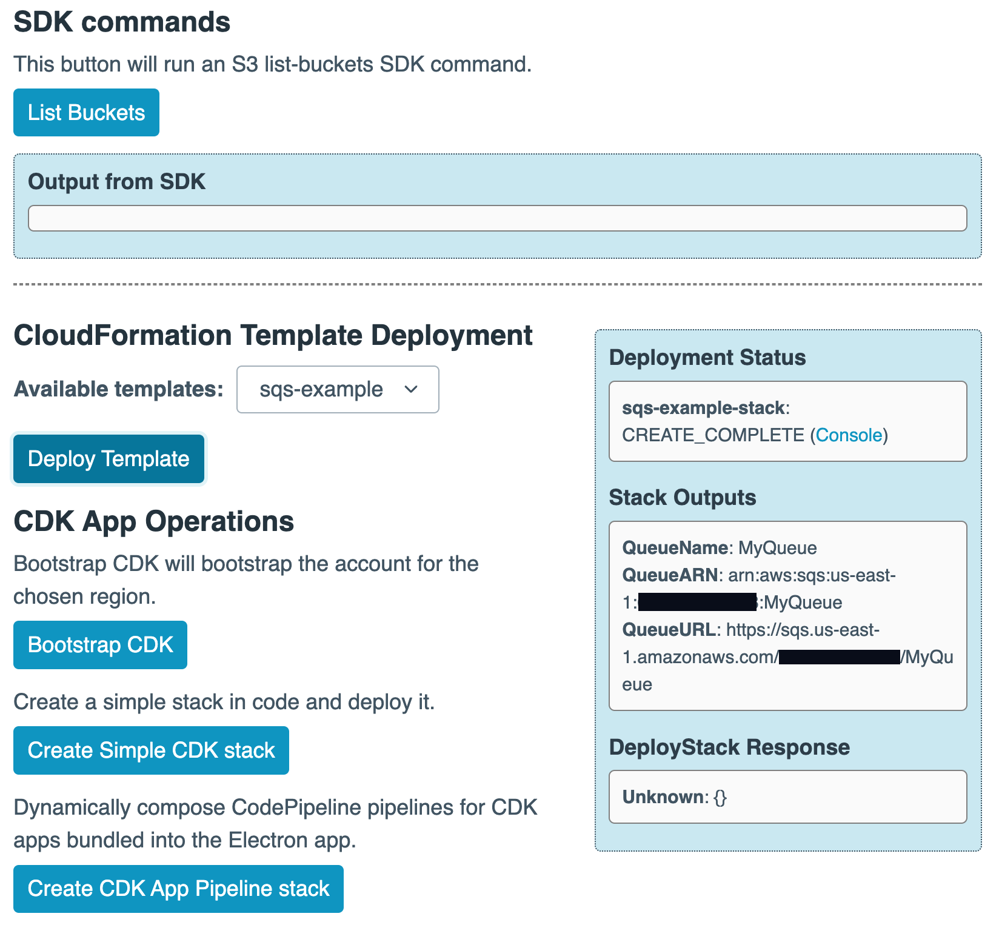

# AWS CDK in Electron

This project demonstrates how to

* Deploy CDK projects, and
* Run SDK commands 

from within an [Electron](https://www.electronjs.org/) app. The app can contain all the dependencies the end user needs, meaning they will not have to install [AWS SDK for JavaScript](https://aws.amazon.com/sdk-for-javascript/), [AWS CDK](https://aws.amazon.com/cdk/), or use the command line.

This sample project can be built as a standalone app that is able to both query and deploy changes to an account. What the standalone app is able to do is dependant on the permissions you give it when you configure it with credentials. It is always recommended that you grant the [least privileges](https://docs.aws.amazon.com/IAM/latest/UserGuide/best-practices.html#grant-least-privilege) required to perform the tasks you want the app to do.

The example app allows you to 

* use the SDK to list the buckets in your account, 
* deploy a bundled [AWS CloudFormation](https://aws.amazon.com/cloudformation/) template,
* bootstrap an account for CDK, 
* compose a small CDK stack in code and deploy it, and 
* install bundled CDK apps using [AWS CodePipeline](https://aws.amazon.com/codepipeline/) and [AWS CodeBuild](https://aws.amazon.com/codebuild/), 

all from within the Electron app environment.

>NOTE: These samples are not intended for production use and are provided to illustrate functionality only.

## To Install, Build and Run

To clone and run this repository you'll need [Git](https://git-scm.com) and [Node.js](https://nodejs.org/en/download/) (which comes with [npm](http://npmjs.com)) installed on your computer. 

From your command line, `git clone` this repo and then `cd` into the directory root. Then:

```bash
npm install
```
To install the dependencies, followed by

```bash
npm start
```
To start the Electron app in developer mode.

To build a standalone packaged Electron app:

```
npm run make
```

The binary will be output to a folder called `out` in your project directory.

>Note: If you're using Linux Bash for Windows, [see this guide](https://www.howtogeek.com/261575/how-to-run-graphical-linux-desktop-applications-from-windows-10s-bash-shell/) or use `node` from the command prompt.


## To use the Electron App

Once it opens you can paste temporary credentials for your account into the credentials box. The format for these credentials is the standard `Command line or programmatic access` output for setting AWS environment variables, as provided by [AWS Identity Center](https://aws.amazon.com/iam/identity-center/) (formerly AWS SSO). 

Using [temporary credentials is best practice](https://docs.aws.amazon.com/IAM/latest/UserGuide/best-practices.html#bp-users-federation-idp), but the sample app also supports [IAM user access keys](https://docs.aws.amazon.com/IAM/latest/UserGuide/id_credentials_access-keys.html) if you need to use them. 

Once the credentials are pasted in, click `Submit Credentials`.

If the provided credentials are valid, the `Regions` dropdown will be populated (via an SDK call), and the credentials, account and principal you are operating as will appear in the `Current credentials` box in the UI. You can change to different credentials using the `Change Credentials` button.

### SDK example
To see a sample SDK call, click the `List Buckets` button to list the buckets in your account. Provided that the credentials you have supplied have the necessary permissions, the output should appear in the UI under the heading `Output from SDK`.

[](assets/ui.png)

### CloudFormation example
Any CloudFormation templates found in the `cfn-templates` directory will be listed in the drop-down and can be deployed by clicking the `Deploy Template` button. Output will appear in the outputs panel.

### CDK example
Three CDK operations can be executed using the CDK test buttons. 

`Bootstrap CDK` will bootstrap the CDK into the account you have loaded credentials for, and the region selected in the dropdown. You may need to run this if you are using an account that you have not used with CDK before.

The `Create Simple CDK stack` button will compose a simple CDK stack called `electron-bucket-stack` that contains an S3 Bucket and will deploy it into whichever region you have chosen.

`Create CDK App Pipeline stack` will look in the `apps` directory and will create a deployment pipeline using CodePipeline for each zipped CDK project it finds. The pipelines will be deployed in a CDK stack called `cdk-app-delivery-pipeline-stack` and it will deploy into whichever region you have chosen.

Zipped CDK projects must contain a `buildspec.yml` at the archive root that instructs CodeBuild how to deploy each app. 

> Note that you can install CDK apps written in any language that can be deployed using CodeBuild.

Deploy CDK apps written in different languages by specifying different `runtime-versions` in the install phase, eg this is a sample `buildspec.yml` that will deploy a single-stack CDK project written in TypeScript:

```
# buildspec.yml
version: 0.2
phases:
  install:
    runtime-versions:
      nodejs: 16
    commands:
      - npm install -g aws-cdk@latest
      - npm install
  build:
    commands:
      - npm run build
      - cdk deploy
```

There are four sample apps you can use to test this in the `apps` folder, each with a working `buildspec.yaml`. Zip the contents (not the folder) of the CDK project (without any locally installed node_modules or python env directories) and place the archive at the root of the `apps` directory, eg

```
apps/
├── app1.zip
├── app1.json
├── app2.zip
├── app2.json
├── app3.zip
├── app3.json
├── python-cdk-app.zip
├── python-cdk-app.json
```

The JSON manifest file that sits alongside the zipped CDK project contains a `Stacks` property that describes the stacks that will be tracked by the Electron app during deployment and a `CodeBuildPolicy` property that will be used to create the service role that will be assumed by CodeBuild when it runs the deployment commands. 


``` json
{
    "Stacks": [
        {
            "name": "HelloStack1",
            "hasOutputs": false
        }
    ],
    "CodeBuildPolicy": {
        "Version": "2012-10-17",
        "Statement": [
            {
                "Sid": "AllowAllAccess",
                "Effect": "Allow",
                "Action": "*",
                "Resource": "*"
            }
        ]
    }
}
```
------

## Electron docs

You can learn more about Electron on [electronjs.org](https://electronjs.org/).

## License

See the LICENSE file.
